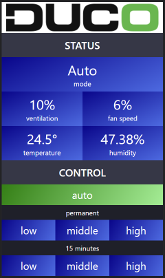

# DUCO Web Control


Control a DUCO ventilation system with a (mobile) web interface.

Utilizes the openHAB MQTT controller of the [DucoBox ESPEasy Plugin](https://github.com/arnemauer/Ducobox-ESPEasy-Plugin).



## Run

Basic

```bash
docker run -e MQTT_SERVER=192.168.1.200 energy164/duco-web:latest
```

With TLS

```bash
docker run -v /cert:/app/cert -e MQTT_SERVER=192.168.1.200 -e TLS=true -e TLS_KEY_FILE=cert/site.key -e TLS_CERT_FILE=site.crt energy164/duco-web:latest
```

With a custom website

```bash
docker run -v /wwwroot:/app/wwwroot energy164/duco-web:latest
```

## Build

```powershell
.\build.ps1
```
